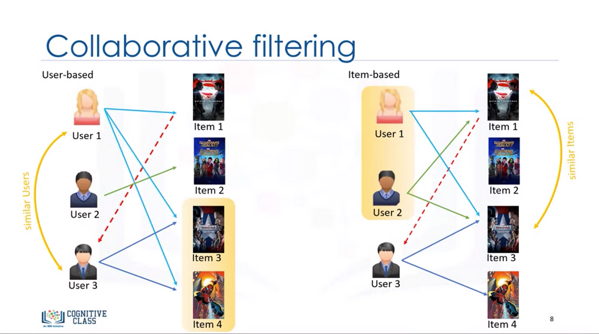

This project was made for learning purpose
Notebook was taken from [link](https://www.kaggle.com/code/stpeteishii/movie-recommendation-using-surprise) 

# Movie Recommendation System

This projects illsutrates how to use **collaborative filtering** using [surprise](https://surprise.readthedocs.io/en/stable/) library to recommend movies to users based on similarity and ratings.

Photo was taken from [link](https://cognitiveclass.ai/courses/build-recommendation-systems-using-collaborative-filtering)
